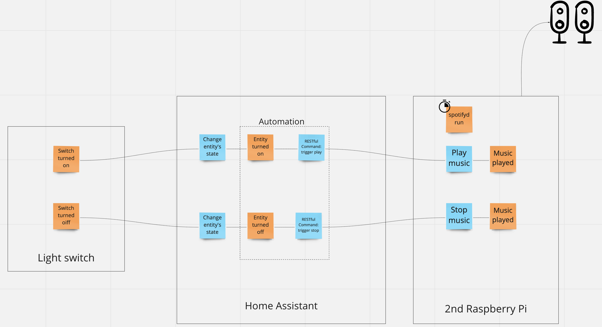

# Radio - my toilet music player 🚽 😅

To avoid awkward moments for your guests - run it up on raspberry PI and integrate with your HomeAssistant using RESTful commands.

## Configuration

To run app:
`./exe`
